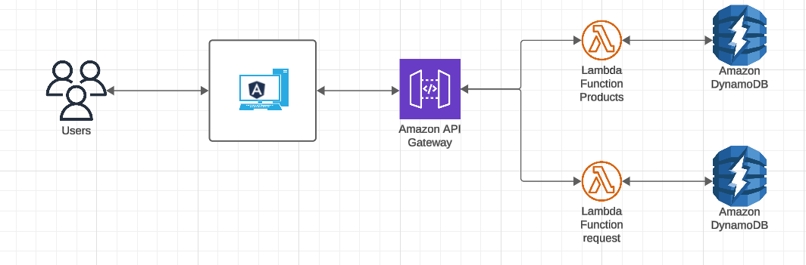

# E-commerce-Platform

When designing your e-commerce platform architecture, consider using a combination of traditional microservices and serverless functions to take advantage of both approaches. Here is the high level architecture diagram:

This design allows for a scalable and modular architecture, where each component fulfills a specific function and can be developed, tested and deployed independently. The combination of microservices and serverless functions provides flexibility and efficiency in handling different parts of the platform. Additionally, utilizing AWS services such as API Gateway and Lambda facilitates scalability and deployment in the cloud.
